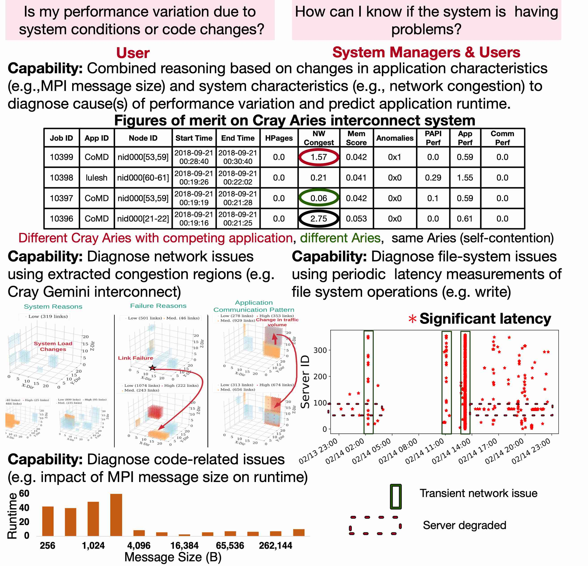
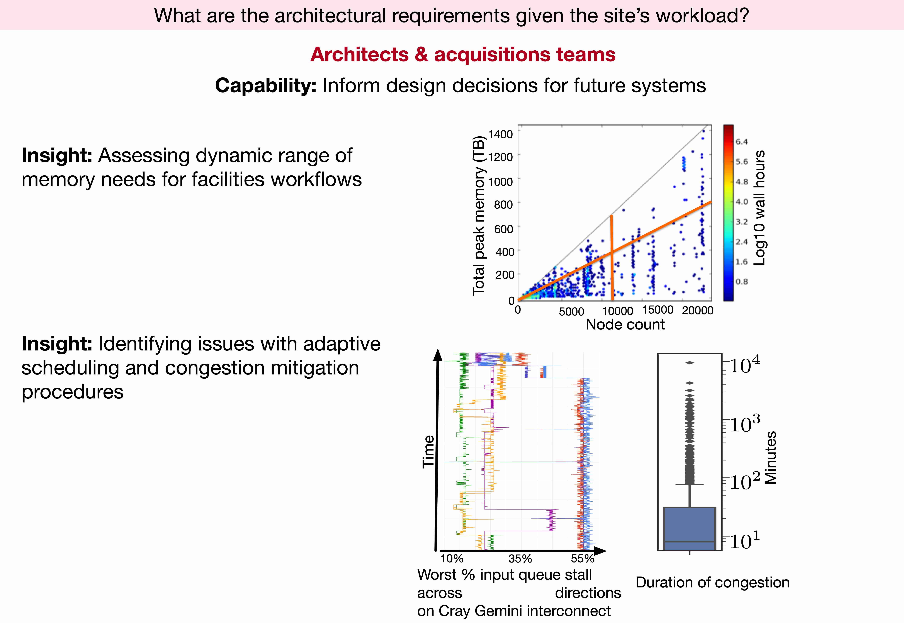

## About ## 
The Holistic Measurement Driven System Assessment (HMDSA) project is designed to enable maximum science production for large-scale high performance computing (HPC) facilities, independent of major component vendor, within the constraints of budget (monetary, space, power). We accomplish this through development and deployment of scalable, platform-independent, open-source tools and techniques for monitoring, coupled with runtime analysis and feedback, which enables highly efficient HPC system operation and usage and also informs future system improvements. 

We take a holistic approach through: 
* Monitoring of all performance impacting information (e.g., atmospheric conditions, physical plant, HPC system components) with flexible frameworks for variable fidelity data collection to minimize application and/or system overhead, 
* Developing scalable storage, retrieval, and run-time analytics to provide identification of performance impacting behaviors, 
* Developing feedback and problem (e.g., faults, resource depletion, contention) mitigation strategies and mechanisms targeting applications, system software, hardware, and users.

<!--
## Sample HMDSA Analysis Insights ##
{:width="720px"}{: .center-image}
{:width="720px"}{: .center-image}
{:width="720px"}{: .center-image}
-->

## HMDSA Features ##

HMDSA provides unique capabilities for run-time system assessment and for transforming those insights into actionable knowledge. Features of HDMSA which make it unprecendented among operational and monitoring systems are:

**Exascale-ready**

HMDSA's architecture and analysis capabilities are exascale-ready, having been demonstrated in production on current large-scale platforms up to 1/4 size of anticipated exascale platforms. Analysis on full-system, long-term data sets have demonstrated computation times for the most complex full-system analysis (a few minutes) down to point-in-time analysis (sub-second) on runtime data. Storage and retrieval have been demonstrated in support of analysis on several continuous years of full system data.

**Unprecedented insights into system and application conditions**

HMDSA analyses provide high resolution extraction and classification of phenomena with respect to locality, severity, and temporal extent. HMDSA high-fidelity data enables insights into phenomena occurring on timescales unresolvable by traditional monitoring capabilities.

**Respond to system conditions at runtime**

Flexible placement of analysis components and multi-directional communications enable low latency feedback of analysis results to system software, applications, and managers. Action can be taken in response to system conditions while applications are still running!

**No adverse application impact**

HMDSA's lightweight, low overhead mechanisms enable high fidelity (e.g. sub-second) synchronized, whole-system numeric and event data capture with no adverse application performance impact.

**Platform independent. Integration of site-specific resources and capabilties is easy**

Operate all platforms in the same way, independent of site and vendor, using HMDSA's platform independent architecture. Site-specific data sources, storage, analysis, and dashboards can be used within or beside HDMSA capabilities using HDMSA's flexible and scalable APIs and transports.

