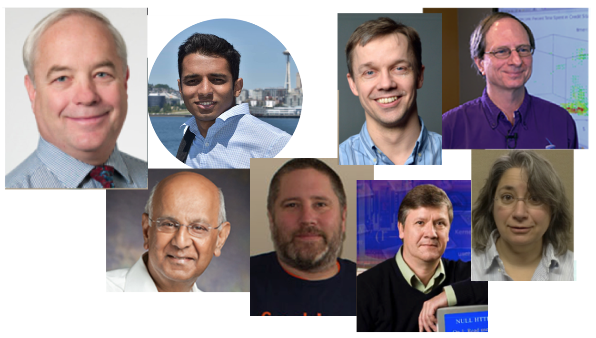

{:width="540px"}{: .center-image}

### Team ###
* PI: Bill Kramer (NCSA/UIUC) <!-- - Director Blue Waters and CS Research Professor -->
* NCSA:
  * Greg Bauer
  * Brett Bode
  * Jeremy Enos <!-- - Blue Waters System Management & Development Lead -->
  * Aaron Saxton
  * Mike Showerman <!-- - Blue Waters System Resource Manager -->
* UIUC:
  * [Saurabh Jha](http://sjha8.web.engr.illinois.edu) (CS/CSL) 
  * Ravi Iyer (ECE/CSL) <!-- - George and Ann Fisher Distinguished Professor of Engineering and Lead of the DEPEND group -->
  * Zbigniew Kalbarczyk (ECE/CSL) <!-- - Principle Research Scientist in the UI Coordinated Systems Laboratory -->
* SNL:
  * Jim Brandt <!-- - Distinguished Member of Technical Staff – SNL HPC Monitoring and Analysis Lead and OVIS/LDMS development lead -->
  * Ann Gentile <!-- - Distinguished Member of Technical Staff - SNL Advanced Technologies Systems Operations Lead and HPC Monitoring and Analysis -->

### Collaborators ###
* New Mexico State University (NMSU)
* Boston University (BU)
* University of Central Florida (UCF)
