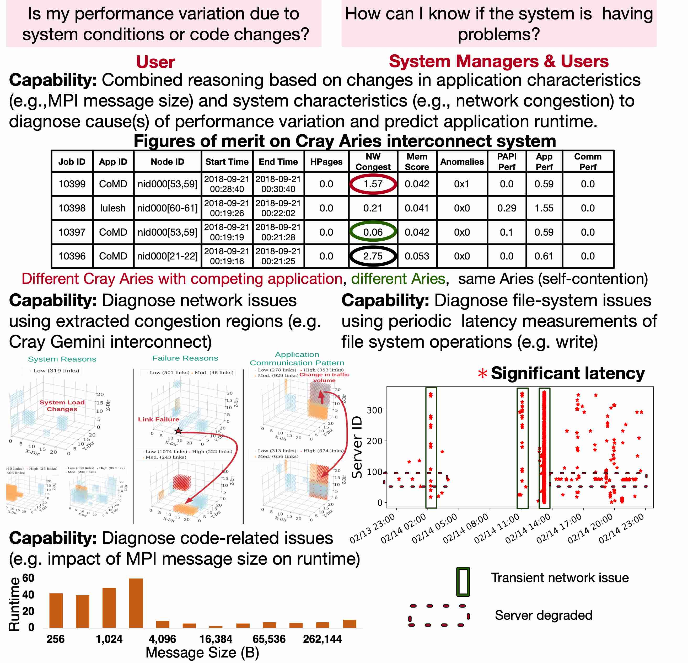
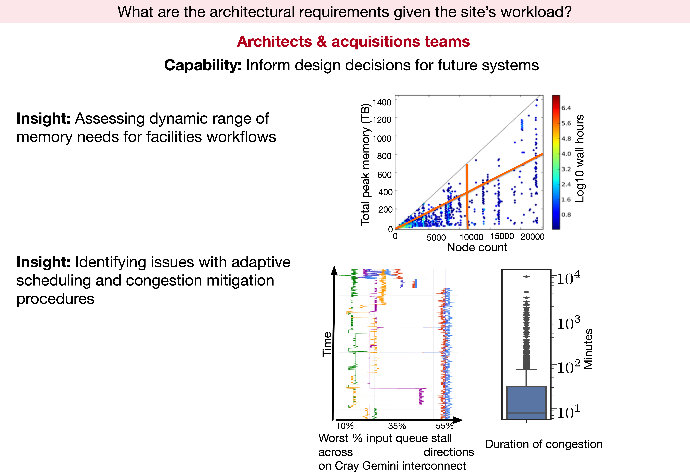
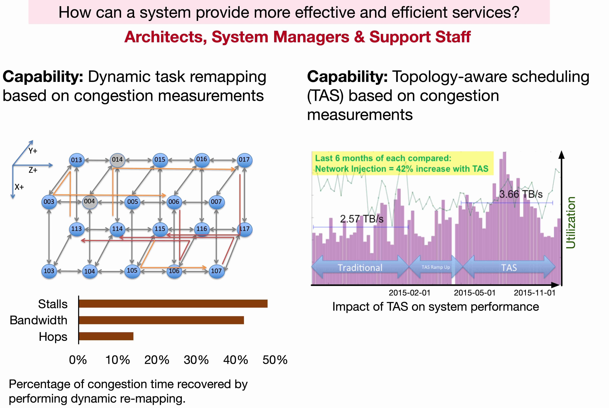

HMDSA builds tools and techniques for answering key questions of interest to Users, System Managers and Support Staff, and Architects and Acquistions Teams:

{:width="720px"}{: .center-image}

{:width="720px"}{: .center-image}

{:width="720px"}{: .center-image}	
