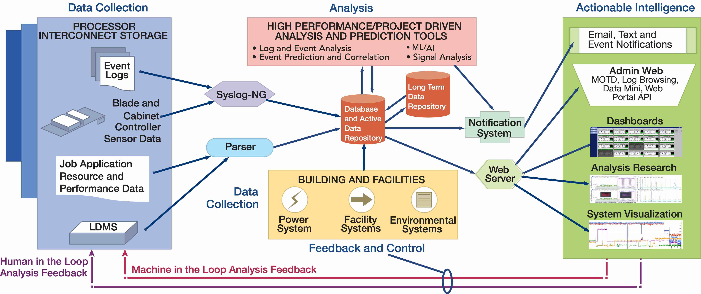

{:width="720px"}{: .center-image}
#### Architectural Features: ####
* Platform independent infrastructure for common operations across facilities
* Scalable - Demonstrated in production over 4 years up to 27K nodes.
* Integrated streaming and historical analysis
* Strategy for long term storage and recall of data for trends

#### Components: ####
* Lightweight Distributed Metric Service (LDMS) - data collection and transport. Run-time tunable fidelity (including subsecond) with no adverse  impact on application performance
* Collectors for application and platform data and integration of external collection (e.g. kokkos)
* Streaming analysis and active feedback capabilities
* Integrated System Console (ISC) - analytics database, retrieval and display
* LogDiver+Baler - event tagging and relationship discovery
* A variety of analysis tools including ML/AI based tools for identification

{:width="720px"}{: .center-image}