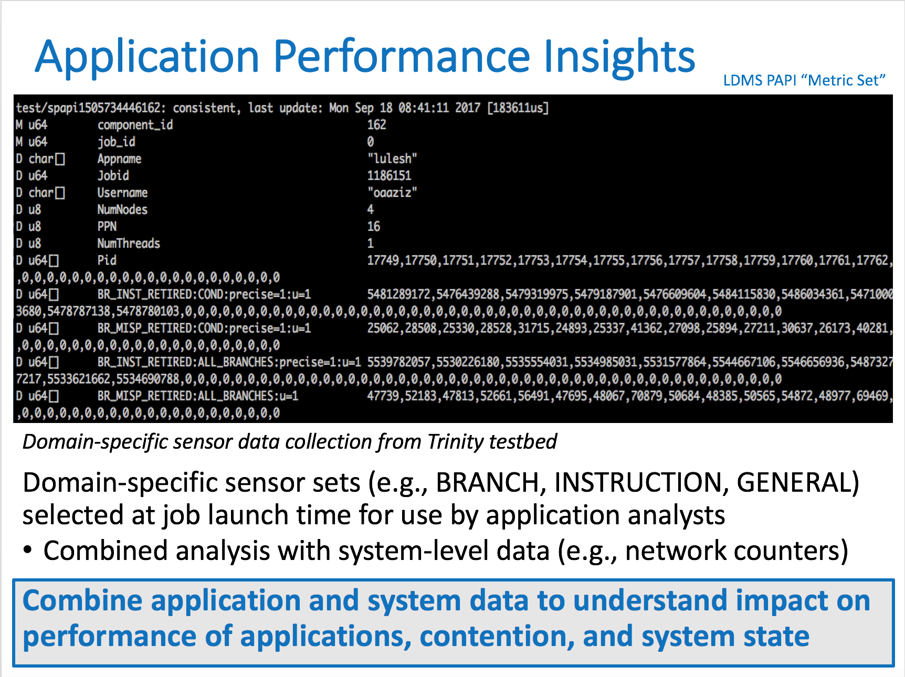
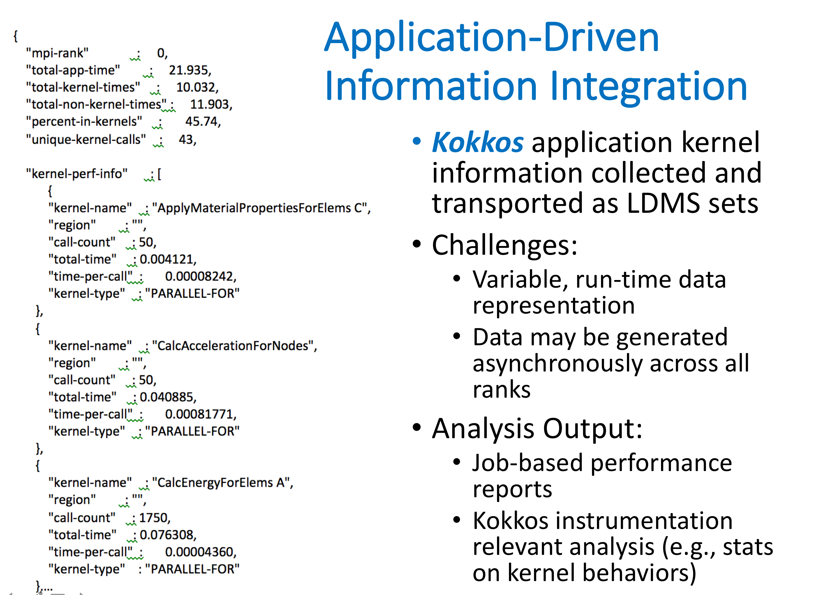
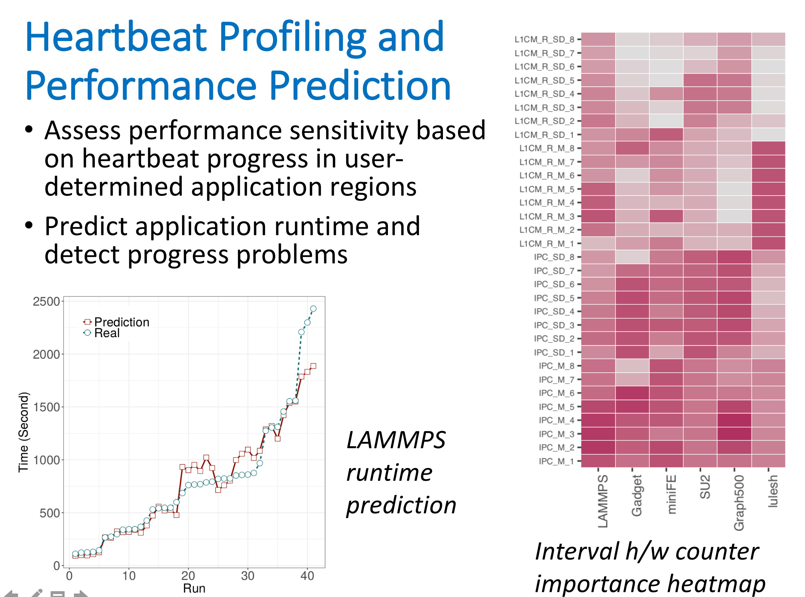
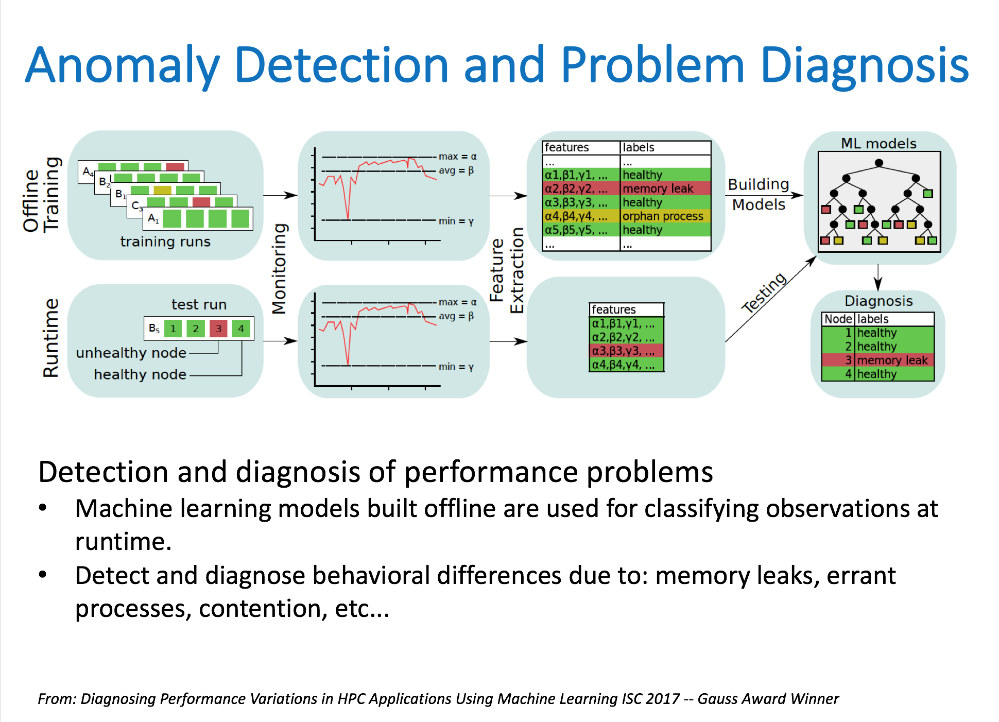

Application data is collected in conjunction with platform and facilities data. Integrated analysis provides insights into whether [performance variation is due to application changes or system conditions](../insights.md). Higher-order *[figures of merit](../insights.md)* provide at-a-glance understanding of all conditions, for running and historical jobs, in a dashboard.

{:width="720px"}{: .center-image}

{:width="720px"}{: .center-image}

{:width="720px"}{: .center-image}

{:width="720px"}{: .center-image}

Slides from *Runtime HPC System and Application Performance Assessment and Diagnostics* CODA 2018.
Application Profiling and Analysis work in collaboration with SNL, NMSU, and BU.

### For more information ###
* *[Runtime HPC System and Application Performance Assessment and Diagnostics](https://ovis.ca.sandia.gov/index.php/Publications_and_presentations)* J. Brandt, A. Gentile, Jon Cook, B. Allan, Jeanine Cook, O. Aaziz, T. Tucker, N. Naksinehaboon, N. Taerat, E. Ates, O. Tuncer, M. Egele, A. Turk, and A. Coskun. Conference on Data Analysis (CODA), Mar 2018. 
* *Diagnosing Performance Variations in HPC Applications Using Machine Learning*. O. Tuncer, E. Ates, Y. Zhang, A. Turk, J. Brandt, V. J. Leung, M. Egele, and A. K. Coskun ISC High Performance 2017 (ISC), Jun 2017.
* *Modeling Expected Application Runtime for Characterizing and Assessing Job Performance* O. Aaziz, J. Cook, and M. Tanash.
Workshop on Monitoring and Analysis of High Performance Computing Systems Plus Applications (HPCMASPA)
at IEEE Int'l. Conf. on Cluster Computing (CLUSTER), Sep 2018. 
